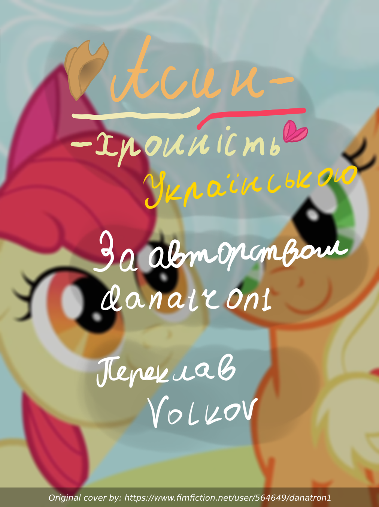

# Асинхронність - Українською

Короткий екзистенційний хоррор. Епл Блум випадково подорожувала, на долю секунду, назад у часі, зрозумівши, що вона там одна. Світ продовжує існувати довкола неї, але без її участі.
Сьогодення це безкінечна пряма лінія між минулим та майбутнім. Усіх кого ви знаєте та любите балансують на ній. Що станеться, якщо ви не втримаєтесь?

# Як відкрити? Де фанфік?
[пдф файл](Asynchronous-ukr.pdf)

Ви його можете одразу читати його у гітхабі, або можете завантажити.

Завантажити його можна двома способами:

Перший:

1. Натисніть правою кнопкою миші по посиланню зверху
2. В залежності від того, який браузер ви використовуєте і мову інтерфейсу, знайдіть пункт у контекстному меню типу: "Зберегти посилання як..." або "Save link as..."
3. Оберіть де зберегти файл і збережіть його.
4. Готово, можете відкривати файл у вашому улюбленому переглядачі документів!

Другий:

1. Перейдіть за посиланням зверху.
2. Десь вгорі знайдіть кнопку зі стрілочкою, яка показує вниз і натисніть на неї.
3. Браузер почне завантажувати файл.
4. Як тільки завантаження завершиться, можете відкривати файл у вашому улюбленому переглядачі документів!

# Контакти:
Якщо помітили очепятку, погано перекладений шмат тексту, є якісь побажання?
Тоді ви можете написати мені тут: [Contacts](https://github.com/Vovkiv/mlp_fics_that_i_plan_to_translate/tree/main#contacts)

# Original fic:
[https://www.fimfiction.net/story/537784/asynchronous](https://www.fimfiction.net/story/537784/asynchronous)
 
# Original cover:
[https://cdn-img.fimfiction.net/story/zcx0-1687263841-537784-full](https://cdn-img.fimfiction.net/story/zcx0-1687263841-537784-full)

# Слідкувати за процесом перекладу і іншими фанфіками, які я вже переклав можна тут:
[https://github.com/Vovkiv/mlp_fics_that_i_plan_to_translate](https://github.com/Vovkiv/mlp_fics_that_i_plan_to_translate)

# Гітхаб теги:
translation fanfiction mlp ukrainian volkov
